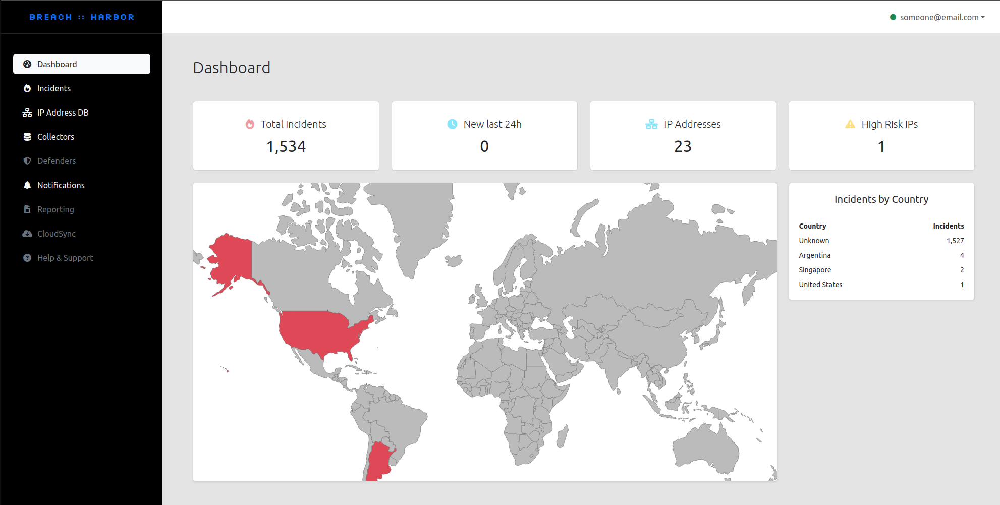

<div align="center">
  <h1>BREACH::HARBOR</h1>
  <p><strong>Proactive Cybersecurity Defense Platform</strong></p>
  
  <p>
    <a href="https://github.com/Dyneteq/Breach-Harbor-Core-API/issues">Report Bug</a>
    ·
    <a href="https://github.com/Dyneteq/Breach-Harbor-Core-API/issues">Request Feature</a>
    ·
    <a href="https://breachharbor.com">Official Website</a>
  </p>
</div>

## Overview

BREACH::HARBOR is a high-performance cybersecurity threat detection and monitoring platform built with Go and HTMX. It provides real-time security incident monitoring through distributed collectors, comprehensive IP address intelligence, and an intuitive web dashboard for threat analysis.

> "Don't just defend, anticipate. Experience the power of proactive protection with modern technology."

<p align="center">
  
</p>

## Key Features

- **🚀 High Performance** - Go backend for exceptional speed and concurrency
- **⚡ Real-time Updates** - HTMX-powered frontend with minimal JavaScript
- **🛡️ Threat Detection** - Identify and analyze security incidents as they emerge
- **🌍 IP Intelligence** - Advanced geolocation and threat analysis using MaxMind GeoIP2
- **📊 Analytics Dashboard** - Comprehensive security metrics and visualizations
- **🔗 Distributed Collection** - Deploy collectors across multiple network environments
- **🔐 Secure Authentication** - JWT-based authentication with bcrypt encryption
- **📱 Responsive Design** - Modern Bootstrap interface that works on all devices

## Architecture

BREACH::HARBOR consists of three primary components:

<div align="center">
  <table>
    <tr>
      <td align="center"><h3>🔍 COLLECTOR</h3></td>
      <td align="center"><h3>🧠 CORE API</h3></td>
      <td align="center"><h3>🛡️ DEFENDER</h3></td>
    </tr>
    <tr>
      <td>Lightweight agents gathering threat data from your environment</td>
      <td>Go-powered central hub for data processing, analysis, and visualization</td>
      <td>Policy enforcement based on intelligence from the Core API</td>
    </tr>
  </table>
</div>

**This repository contains the Core API** built with:
- **Backend**: Go with Gin framework and GORM
- **Frontend**: HTMX with Bootstrap for responsive UI
- **Database**: SQLite3 for simplicity and portability
- **Authentication**: JWT tokens with secure session management

## Quick Start

### Prerequisites

- **Go 1.21+** - [Download Go](https://golang.org/doc/install)
- **MaxMind Account** - [Free GeoLite2 account](https://www.maxmind.com/en/geolite2/signup)

### Installation

1. **Clone and setup**
   ```bash
   git clone https://github.com/Dyneteq/Breach-Harbor-Core-API.git
   cd Breach-Harbor-Core-API
   
   # Copy environment template
   cp .env.example .env
   ```

2. **Configure environment**
   ```bash
   # Edit .env with your settings
   nano .env
   ```

3. **Download MaxMind database** (Optional - for IP geolocation)
   ```bash
   # Create data directory
   mkdir -p data
   
   # Option 1: Automatic download (requires license key)
   # Sign up at https://www.maxmind.com/en/geolite2/signup
   # Get your license key and run:
   # ./scripts/download-geoip.sh YOUR_LICENSE_KEY
   
   # Option 2: Manual download
   # Download GeoLite2-City.mmdb from MaxMind and place in ./data/
   # Note: Application will start without this file but geolocation will be limited
   ```

4. **Install dependencies and run**
   ```bash
   # Download Go dependencies
   go mod download
   
   # Build and run the application
   go run cmd/server/main.go
   ```

5. **Access the application**
   - **Web Interface**: http://localhost:8080
   - **Health Check**: http://localhost:8080/health
   - **API Documentation**: http://localhost:8080/api/v1

## Configuration

### Environment Variables

Create a `.env` file with the following configuration:

```env
# Database Configuration
DB_PATH=./breach_harbor.db

# JWT Authentication
JWT_SECRET=your_super_secure_jwt_secret_at_least_32_characters
JWT_EXPIRY_MINUTES=60

# Server Configuration
SERVER_PORT=8080
SERVER_HOST=localhost

# MaxMind GeoIP Database
MAXMIND_DB_PATH=./data/GeoLite2-City.mmdb

# CORS Configuration
CORS_ALLOWED_ORIGINS=http://localhost:3000,https://yourdomain.com

# Logging
LOG_LEVEL=info
```

## API Reference

### Authentication Endpoints
```
POST /api/v1/auth/login       - User authentication
POST /api/v1/auth/register    - User registration
GET  /api/v1/user             - Get current user info
```

### Dashboard Analytics
```
GET /api/v1/analyst/get_stats              - Dashboard statistics
GET /api/v1/analyst/get_all_ip_addresses   - IP address listing
GET /api/v1/analyst/get_by_ip_address/:ip  - IP address analysis
```

### Collector Management
```
GET  /api/v1/collector/get_all                    - User's collectors
POST /api/v1/collector/create_or_update           - Create/update collector
GET  /api/v1/collector/:name                      - Get collector by name
POST /api/v1/collector/incident                   - Submit incident (collector auth)
GET  /api/v1/collector/incident/get_all           - All user incidents
GET  /api/v1/collector/incident/:id               - Specific incident
GET  /api/v1/collector/:name/incident/get_all     - Collector-specific incidents
```

## Web Interface

The HTMX-powered frontend provides an intuitive interface:

- **`/login`** - Secure user authentication
- **`/dashboard`** - Real-time security overview and statistics
- **`/collectors`** - Manage and monitor data collection agents
- **`/incidents`** - Analyze security events and threats
- **`/ip-addresses`** - IP address intelligence and geolocation data

## Development

### Project Structure

```
breach-harbor-core/
├── cmd/server/              # Application entry point
├── internal/
│   ├── config/             # Configuration management
│   ├── handlers/           # HTTP request handlers
│   ├── middleware/         # Authentication and middleware
│   ├── models/            # Database models and schemas
│   └── services/          # Business logic and services
├── templates/             # HTMX HTML templates
├── static/               # CSS, JavaScript, and assets
├── data/                 # MaxMind database files
├── .env                  # Environment configuration
├── go.mod               # Go module dependencies
└── README.md           # This file
```

### Adding New Features

1. **Define models** in `internal/models/`
2. **Implement business logic** in `internal/services/`
3. **Add HTTP handlers** in `internal/handlers/`
4. **Create HTMX templates** in `templates/`
5. **Update routing** in `cmd/server/main.go`
6. **Add styles** in `static/css/`

### Building and Testing

```bash
# Build the application
go build -o server cmd/server/main.go

# Run tests
go test ./...

# Run with coverage
go test -cover ./...

# Format code
go fmt ./...

# Check for issues
go vet ./...
```

## Deployment

### Docker Deployment (Recommended)

```dockerfile
FROM golang:1.21-alpine AS builder

WORKDIR /app
COPY . .
RUN go mod download
RUN go build -o server cmd/server/main.go

FROM alpine:latest

RUN apk --no-cache add ca-certificates tzdata
WORKDIR /root/

# Copy application files
COPY --from=builder /app/server .
COPY --from=builder /app/templates ./templates
COPY --from=builder /app/static ./static
COPY --from=builder /app/data ./data

# Expose port
EXPOSE 8080

# Run the application
CMD ["./server"]
```

### Docker Compose

```yaml
version: '3.8'

services:
  app:
    build: .
    ports:
      - "8080:8080"
    environment:
      - DB_PATH=/home/breach/breach_harbor.db
      - JWT_SECRET=your_super_secure_jwt_secret_key_at_least_32_characters_long_12345
      - JWT_EXPIRY_MINUTES=60
      - SERVER_HOST=0.0.0.0
      - SERVER_PORT=8080
      - MAXMIND_DB_PATH=./data/GeoLite2-City.mmdb
      - CORS_ALLOWED_ORIGINS=http://localhost:3000,http://localhost:8080
      - LOG_LEVEL=info
    volumes:
      - ./data:/home/breach/data:ro
      - breach_data:/home/breach
    restart: unless-stopped

volumes:
  breach_data:
    driver: local
```

### Production Deployment

1. **Environment Configuration**
   ```bash
   # Set production environment variables
   export DB_PATH=/var/lib/breach-harbor/breach_harbor.db
   export JWT_SECRET=your-production-jwt-secret
   export LOG_LEVEL=info
   ```

2. **Database Setup**
   ```bash
   # Create data directory
   sudo mkdir -p /var/lib/breach-harbor
   sudo chown -R breach-harbor:breach-harbor /var/lib/breach-harbor
   ```

3. **SSL/TLS Configuration**
   - Configure reverse proxy (nginx/traefik)
   - Set up SSL certificates (Let's Encrypt recommended)
   - Update CORS settings for production domains

4. **System Service**
   ```bash
   # Create systemd service
   sudo cp deploy/breach-harbor.service /etc/systemd/system/
   sudo systemctl enable breach-harbor
   sudo systemctl start breach-harbor
   ```

## Performance

BREACH::HARBOR with Go delivers exceptional performance:

- **⚡ Response Time**: <10ms average API response
- **🔄 Concurrency**: Handle 1000+ concurrent requests
- **💾 Memory**: ~50MB base memory usage
- **📈 Throughput**: 10,000+ requests per second
- **🚀 Startup**: <1 second cold start time

## Security Features

- **🔐 JWT Authentication** with secure token management
- **🛡️ Password Hashing** using bcrypt with salt
- **🌐 CORS Protection** with configurable origins
- **🔒 Input Validation** and SQL injection prevention
- **📊 User Data Isolation** with query-level filtering
- **🔑 Secure Tokens** for collector authentication

## Contributing

We welcome contributions to BREACH::HARBOR!

1. **Fork** the repository
2. **Create** a feature branch (`git checkout -b feature/amazing-feature`)
3. **Commit** your changes (`git commit -m 'Add amazing feature'`)
4. **Push** to the branch (`git push origin feature/amazing-feature`)
5. **Open** a Pull Request

### Development Guidelines

- Follow Go best practices and conventions
- Add tests for new functionality
- Update documentation for API changes
- Use conventional commit messages
- Ensure all tests pass before submitting

## Roadmap

### Upcoming Features

- **📈 Advanced Analytics** - Machine learning threat detection
- **🔔 Enhanced Notifications** - Multi-channel alert system
- **🔍 Advanced Search** - Full-text search across incidents
- **📱 Mobile App** - Native iOS/Android applications
- **🤖 API Automation** - Webhook integrations and automation
- **🔐 RBAC** - Role-based access control
- **📊 Custom Dashboards** - User-configurable analytics views

### System Improvements

- **🐳 Kubernetes Support** - Cloud-native deployment
- **📈 Horizontal Scaling** - Multi-instance deployment
- **🔄 Real-time Streaming** - WebSocket-based live updates
- **🔍 Advanced Monitoring** - Prometheus/Grafana integration

## License

BREACH::HARBOR is released under the [GPL-3.0 license](https://github.com/Dyneteq/Breach-Harbor-Core-API/blob/master/LICENCE).

## Support

- **🐛 Issues**: [GitHub Issues](https://github.com/Dyneteq/Breach-Harbor-Core-API/issues)
- **📚 Documentation**: Check `/docs` for detailed guides
- **💬 Community**: Join our Discord for discussions
- **📧 Email**: security@breachharbor.com

---

<div align="center">
  <a href="https://breachharbor.com">
    
  </a>
  <a href="https://github.com/Dyneteq/Breach-Harbor-Core-API/issues">
    
  </a>
  <a href="https://github.com/Dyneteq/Breach-Harbor-Core-API/blob/master/LICENCE">
    
  </a>
  <a href="https://golang.org/">
    
  </a>
</div>

<div align="center">
  <strong>BREACH::HARBOR</strong> - Next-Generation Cybersecurity Defense
</div>