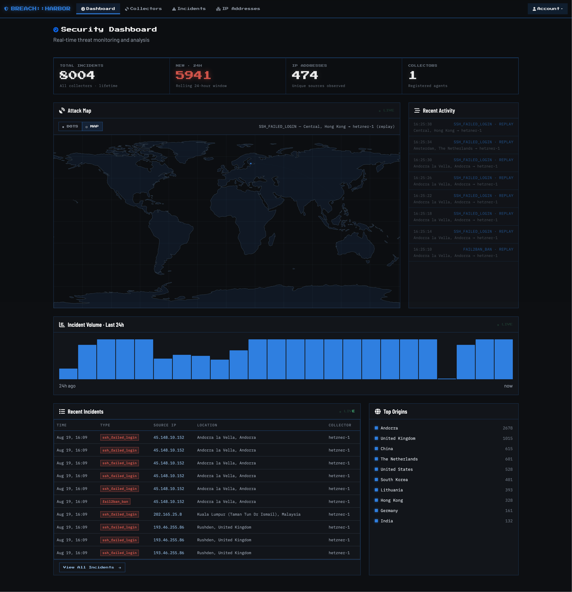

<div align="center">
  <h1>BREACH::HARBOR</h1>
  <p><strong>The threat blocking agent you can set up in five minutes and actually understand.</strong></p>

  <p>
    <a href="https://github.com/Dyneteq/Breach-Harbor/issues">Report Bug</a>
    ·
    <a href="https://github.com/Dyneteq/Breach-Harbor/issues">Request Feature</a>
    ·
    <a href="https://breachharbor.com">Website</a>
    ·
    <a href="https://discord.gg/e7QMAfAPvY">Discord</a>
  </p>

  <pre><code>curl -fsSL https://breachharbor.com/install.sh | sh</code></pre>
</div>



---

## 💖 Enjoying Breach Harbor?

Help keep it free and actively developed by [buying me a coffee](https://coff.ee/chrisveleris) ☕, [becoming a sponsor](https://github.com/sponsors/chrisvel), or [supporting on Patreon](https://www.patreon.com/ChrisVeleris). If you're running this at a company, a **business license** funds the project too (see [Pricing on the website](https://breachharbor.com/#pricing)). Every contribution helps keep the build machines running and the blocklist honest.

---

## What it is

One static binary, two modes:

```
breachharbor agent     # watches one machine and blocks attackers
breachharbor server    # aggregates signal from many agents, publishes blocklists
```

The agent auto-detects your logs (sshd, nginx, fail2ban), watches quietly for 24 hours by
default, and blocks nothing until you tell it to. Everything it blocks lives in one dedicated
firewall table, so `breachharbor agent flush` undoes all of it, instantly, any time. No server
required: the agent is a complete product on its own.

## Quick start

```bash
curl -fsSL https://breachharbor.com/install.sh | sh
breachharbor doctor
```

That downloads the right prebuilt binary for your OS/arch (linux/amd64, linux/arm64,
darwin/arm64, openbsd/amd64), verifies its checksum, and installs it to `/usr/local/bin`.
No release built for your platform yet? Build from source instead (requires Go 1.24+):

```bash
git clone https://github.com/Dyneteq/Breach-Harbor.git
cd Breach-Harbor
make build
./bin/breachharbor doctor
```

`doctor` tells you what's ready to go and what isn't; it never needs root.

```bash
breachharbor agent flush          # always safe: reports what would be removed
sudo breachharbor agent flush --yes    # actually removes it
```

## Run as a daemon

```bash
sudo breachharbor agent install     # systemd (Linux) or launchd (macOS)
sudo breachharbor server install --listen :8080
```

Installs a service that starts at boot and restarts on crash: a systemd unit on Linux
(`sudo systemctl status breachharbor-agent`), a LaunchDaemon on macOS (`sudo launchctl list |
grep breachharbor`, logs at `<data-dir>/agent.log`). The agent comes up in dry run by default;
add `--enforce` to start enforcing immediately. `breachharbor agent uninstall` removes the
service and flushes every firewall rule it added.

## Updating

```bash
breachharbor update           # installs the latest release over the running binary
breachharbor update --check   # just report whether a newer release exists
```

Re-run with `sudo` if the binary lives in a root-owned directory (the default
`/usr/local/bin` install does). Updates both `breachharbor` and `bh` when both are present.

## Status

Being rebuilt into the CLI above, one milestone at a time:

- ✅ **M0: it builds.** `version`, `doctor`, `agent flush` work today.
- ✅ **M1: the agent stands alone.** `agent run/status/top/enforce/sources/install/uninstall` all work.
- ✅ **M2: the server is useful.** `server run/install/status` and `agent enroll` work; agents can
  publish to a server and pull its blocklist.
- ⏳ **M3: trust hardening** and **M4: sharing.** Sketched, not started.

## Development

```bash
make build       # bin/breachharbor + bin/bh
make test
make vet
make fmt-check
```

CI runs all of these plus a cross-compile check for linux/amd64, linux/arm64, darwin/arm64,
openbsd/amd64.

## Docker

```bash
docker build -t breachharbor .
docker compose up
```

Static binary, no CGO, ~8MB image. Healthcheck is just `breachharbor doctor --json`.

## Security notes

- Nothing leaves the machine unless you run `breachharbor agent enroll <url>`; `doctor` shows
  exactly what would be sent and where.
- No AI/ML. Detection is plain rules plus free public threat feeds (Spamhaus, FireHOL, Tor exit
  nodes).

## Contributing

PRs welcome: fork, branch, and open a pull request. Add tests: this runs as root and edits
firewalls, so untested code doesn't ship.

## Attribution

IP geolocation/ASN enrichment is powered by one of these, whichever database you install into
`./data` (see `scripts/download-geoip.sh` and `scripts/download-geoip-dbip.sh`):

- [MaxMind GeoLite2](https://www.maxmind.com) - this product includes GeoLite2 data created by
  MaxMind, available from [maxmind.com](https://www.maxmind.com).
- [DB-IP](https://db-ip.com) - IP geolocation by DB-IP, licensed under
  [CC BY 4.0](https://creativecommons.org/licenses/by/4.0/).

## License

[GPL-3.0](https://github.com/Dyneteq/Breach-Harbor/blob/master/LICENCE)

## Support

[GitHub Issues](https://github.com/Dyneteq/Breach-Harbor/issues)

Join the Breach Harbor community:

[](https://discord.gg/e7QMAfAPvY)

## 🌟 Please check my other projects!

- **[tududi](https://tududi.com)** - Self-hosted task and project management app
- **[Reconya](https://reconya.com)** - Network reconnaissance and asset discovery tool
